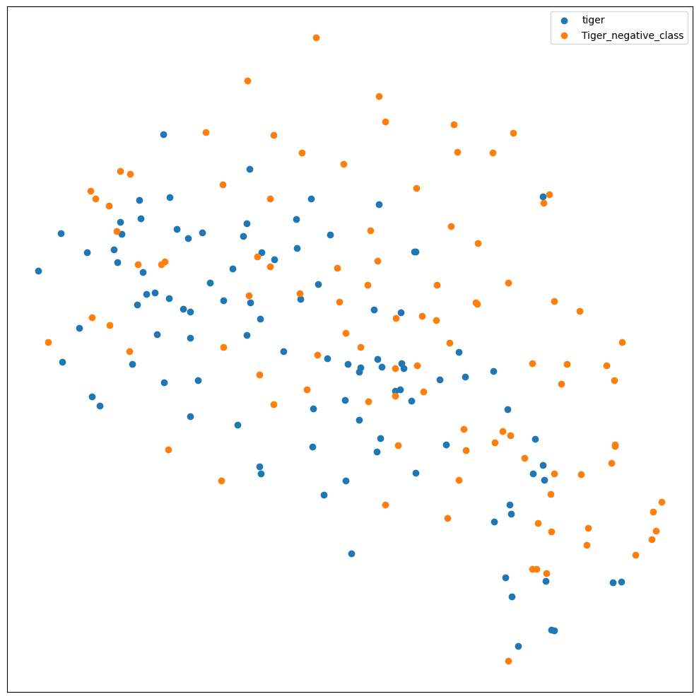
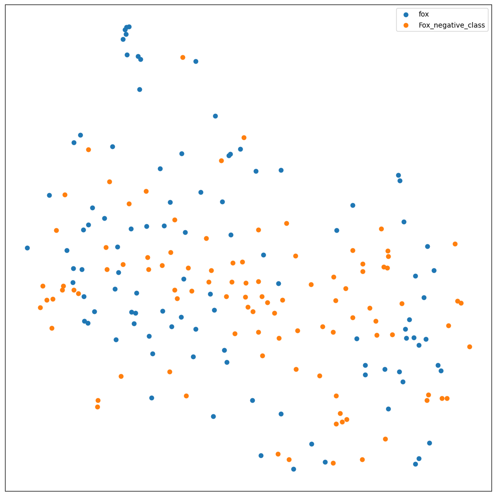
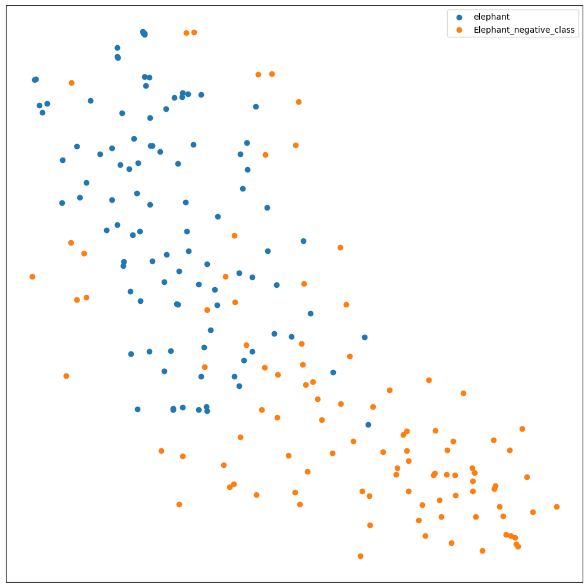

#  Implémentation Deep learning
Dans le cadre du projet de Machine Learning, nous avons eu l’opportunité de travailler sur des algorithmes de Deep Learning. Le but étant d’obtenir un modèle pour chacun des animaux qui puissent prédire si l’image de test correspond à l’animal recherché ou pas. Une grande partie est consacrée à pouvoir générer des images, plus précisément sur les renards.

# Table des Matières

1. [Introduction](#introduction) 
2. [Création de baseline](#création-de-baseline)
   1. [Visualisation des données](#visualisation-des-données)
   2. [Les baselines](#les-baselines)
3. [Optimisation](#optimisation)
   1. [Baseline Améliorée Éléphant](#baseline-améliorée-éléphant)
   2. [Baseline Améliorée Tigre](#baseline-améliorée-tigre)
   3. [Baseline Améliorée Renard](#baseline-améliorée-renard)
4. [ImageDataGenerator](#imagedatagenerator)
   1. [Modèle Éléphant](#modèle-éléphant)
   2. [Modèle Tigre](#modèle-tigre)
   3. [Modèle Renard](#modèle-renard)
5. [Transfer Learning](#transfer-learning)
   1. [Modèle Éléphant](#modèle-éléphant-1)
   2. [Modèle Tigre](#modèle-tigre-1)
   3. [Modèle Renard](#modèle-renard-1) 
6. [Generative Adversarial Network Fox](#generative-adversarial-network-fox)
   1. [Prédiction sur les sorties du GAN](#prédiction-sur-les-sorties-du-gan) 
7. [Modèle le plus complexe : contenu des sorties des CNN](#modèle-le-plus-complexe-contenu-des-sorties-des-cnn)
8. [Conclusion](#conclusion)

## Introduction

Dans cette étude, notre objectif est de construire des modèles de classification binaire capables d'identifier, à partir d'une image donnée, si celle-ci correspond à l'animal recherché ou pas ; nous allons rechercher un renard, un éléphant ou un tigre. 

Pour ce faire, notre travail se décomposera en plusieurs étapes :

- **Création d'une baseline pour chaque animal** : Nous débuterons en construisant un modèle de base pour effectuer nos premières prédictions. Les résultats obtenus nous guideront dans les étapes suivantes de notre travail.

- **Amélioration du modèle** : Nous envisagerons des stratégies d'amélioration des modèles, incluant la recherche d'hyperparamètres, l'application de techniques de régularisation, l'augmentation des données, etc.

- **Exploration des modèles de transfert learning** : Nous examinerons l'utilisation de techniques de transfert learning pour capitaliser sur des modèles pré-entraînés et les adapter à notre tâche spécifique.

- **Génération d'images de renards via GAN** : Enfin, nous explorerons la génération d'images de renards à l'aide de GAN pour ensuite les tester sur notre meilleur modèle de prédiction de renards.

Cette approche nous permettra d'explorer et de perfectionner nos modèles pour atteindre des performances optimales dans l'identification des trois animaux ciblés.

## Création de baseline

### Visualisation des données

Avant de débuter le projet, nous voulons visualiser la distribution des données dans leur ensemble. Cette étape nous permettra de mieux appréhender la nature des données et d'analyser comment elles se regroupent.

 <table>
  <tr>
    <td align="center">t-SNE sur les données tigre</td>
    <td align="center">t-SNE sur les données renard</td>
    <td align="center">t-SNE sur les données éléphant</td>
  </tr>
  <tr>
    
    
    
  </tr>
 </table>

_Visualisation des jeux de données grâce à la technique t-SNE._

**Que peut-on en déduire ?**

On peut remarquer que pour les données 'tiger' et 'fox', il n'y a pas de séparation nette entre les deux classes. Pour ces données, il va être plus difficile pour le classifieur de différencier les images, cependant pour les données éléphant on peut remarquer que les données se distinguent plus.

Les jeux de données de renard et tigre sont mélangés, on sait d'avance que le modèle va sans doute trop se concentrer sur certains patterns communs, il nous faudra ainsi mettre des couches de dropout pour éviter que le modèle se focalise trop sur certains détails.

### Les baselines

