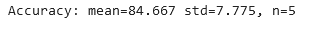

#  Implémentation Deep learning
Dans le cadre du projet de Machine Learning, nous avons eu l’opportunité de travailler sur des algorithmes de Deep Learning. Le but étant d’obtenir un modèle pour chacun des animaux qui puissent prédire si l’image de test correspond à l’animal recherché ou pas. Une grande partie est consacrée à pouvoir générer des images, plus précisément sur les renards.

# Table des Matières

1. [Introduction](#introduction) 
2. [Création de baseline](#création-de-baseline)
   1. [Visualisation des données](#visualisation-des-données)
   2. [Les baselines](#les-baselines)
3. [Optimisation](#optimisation)
   1. [Baseline Améliorée Éléphant](#baseline-améliorée-éléphant)
   2. [Baseline Améliorée Tigre](#baseline-améliorée-tigre)
   3. [Baseline Améliorée Renard](#baseline-améliorée-renard)
4. [ImageDataGenerator](#imagedatagenerator)
   1. [Modèle Éléphant](#modèle-éléphant)
   2. [Modèle Tigre](#modèle-tigre)
   3. [Modèle Renard](#modèle-renard)
5. [Transfer Learning](#transfer-learning)
   1. [Modèle Éléphant](#modèle-éléphant-1)
   2. [Modèle Tigre](#modèle-tigre-1)
   3. [Modèle Renard](#modèle-renard-1) 
6. [Generative Adversarial Network Fox](#generative-adversarial-network-fox)
   1. [Prédiction sur les sorties du GAN](#prédiction-sur-les-sorties-du-gan) 
7. [Modèle le plus complexe : contenu des sorties des CNN](#modèle-le-plus-complexe-contenu-des-sorties-des-cnn)
8. [Conclusion](#conclusion)

## Introduction

Dans cette étude, notre objectif est de construire des modèles de classification binaire capables d'identifier, à partir d'une image donnée, si celle-ci correspond à l'animal recherché ou pas ; nous allons rechercher un renard, un éléphant ou un tigre. 

Pour ce faire, notre travail se décomposera en plusieurs étapes :

- **Création d'une baseline pour chaque animal** : Nous débuterons en construisant un modèle de base pour effectuer nos premières prédictions. Les résultats obtenus nous guideront dans les étapes suivantes de notre travail.

- **Amélioration du modèle** : Nous envisagerons des stratégies d'amélioration des modèles, incluant la recherche d'hyperparamètres, l'application de techniques de régularisation, l'augmentation des données, etc.

- **Exploration des modèles de transfert learning** : Nous examinerons l'utilisation de techniques de transfert learning pour capitaliser sur des modèles pré-entraînés et les adapter à notre tâche spécifique.

- **Génération d'images de renards via GAN** : Enfin, nous explorerons la génération d'images de renards à l'aide de GAN pour ensuite les tester sur notre meilleur modèle de prédiction de renards.

Cette approche nous permettra d'explorer et de perfectionner nos modèles pour atteindre des performances optimales dans l'identification des trois animaux ciblés.

## Création de baseline

### Visualisation des données

Avant de débuter le projet, nous voulons visualiser la distribution des données dans leur ensemble. Cette étape nous permettra de mieux appréhender la nature des données et d'analyser comment elles se regroupent.

 <table>
  <tr>
    <td align="center">t-SNE sur les données tigre</td>
    <td align="center">t-SNE sur les données renard</td>
    <td align="center">t-SNE sur les données éléphant</td>
  </tr>
  <tr>
    <td></td>
    <td></td>
    <td></td>
  </tr>
 </table>

_Visualisation des jeux de données grâce à la technique t-SNE._

**Que peut-on en déduire ?**

On peut remarquer que pour les données 'tiger' et 'fox', il n'y a pas de séparation nette entre les deux classes. Pour ces données, il va être plus difficile pour le classifieur de différencier les images, cependant pour les données éléphant on peut remarquer que les données se distinguent plus.

Les jeux de données de renard et tigre sont mélangés, on sait d'avance que le modèle va sans doute trop se concentrer sur certains patterns communs, il nous faudra ainsi mettre des couches de dropout pour éviter que le modèle se focalise trop sur certains détails.

### Les baselines

Nous avons donc créé la Baseline à partir des notebooks du module de Machine Learning 2, nous pouvons observer sur la Figure la structure du modèle utilisé pour chaque jeu de données. 

 <table>
  <tr>
    <td align="center">Summary de la baseline</td>
  </tr>
  <tr>
    <td></td>
  </tr>
 </table>

Résultats des 5 folds pour le modèle Baseline
  <table>
  <tr>
    <td align="center">Résultat tigre</td>
    <td align="center">Résultat renard</td>
    <td align="center">Résultat éléphant</td>
  </tr>
  <tr>
    <td></td>
    <td></td>
    <td></td>
  </tr>
 </table>

Moyenne d'accuracy, écart-type sur les 5 folds pour chaque jeu de données

<table>
  <tr>
    <td align="center">Résultat tigre</td>
    <td align="center">Résultat renard</td>
    <td align="center">Résultat éléphant</td>
  </tr>
  <tr>
    <td></td>
    <td></td>
    <td></td>
  </tr>
 </table>

**Interprétation des données :** Dans la majorité des cas de la Figure, nous avons du surapprentissage.
Pour les trois animaux nous rencontrons  des scénarios similaires :
-   La validation loss augmente et la training loss diminue, le modèle apprend trop bien sur les données d’entraînement.
-   La validation accuracy est toujours plus faible que la training accuracy, le modèle performe bien sur les données d’entraînement, mais ne généralise pas bien sur les nouvelles données. Il est en train de surapprendre les caractéristiques spécifiques de l’ensemble d’entrainement.
Nous remarquons que l'écart-type moyen des jeux de données est élevé donc que les accuracy s'éloignent de celle moyenne, les résultats ne sont pas assez stables.

## Optimisation ##

Tout d'abord nous recherchons maintenant la meilleure combinaison d'hyper-paramètres pour optimiser le modèle Baseline, pour ce faire nous  utilisons un random search sur plusieurs hyper-paramètres. Après avoir ciblé la meilleure combinaison avec random search, nous  utilisons un grid search pour essayer des combinaisons en prenant pour base celle trouvée précédemment avec le random search. 

Nous souhaitons évaluer les hyper-paramètres suivants : la fonction d'activation d'une des couches du réseau de neurones, le batch\_size, l'optimizer et son learning_rate.
Afin de prévenir le surapprentissage un EarlyStopping sur la loss de validation a été ajouté, grâce à cela nous pouvons arrêter le nombre d'epochs plus tôt en cas d'augmentation de validation loss. 

### Baseline Améliorée Éléphant ###

Pour les meilleurs hyper-paramètres nous effectuons un random search puis un grid search comme expliqué précédemment. 
Cependant cette expérience génère les meilleurs hyper-paramètres pour un jeu de données d'entraînement et de validation précis, c'est pourquoi nous effectuons une validation croisée sur 5 folds pour faire cette expérience sur chacun des folds et ainsi obtenir 5 meilleurs hyper-paramètres. 

Les 5 combinaisons obtenues ont les mêmes résultats pour la fonction d'activation et le batch_size. Pour les deux paramètres learning_rate et optimizer nous prendrons la valeur ayant la majorité, 4/5 des combinaisons avaient le même learning\_rate (égal à 0.001) et 3/5 des combinaisons optent pour l'optimizer adam (les autres ont utilisés adamax). 

Nous considérons donc que la meilleure combinaison est celle égale aux combinaisons 1, 3 et 5. 

<table>
  <tr>
    <td align="center">Combinaisons des meilleurs hyper-paramètres pour 5 folds</td>
  </tr>
  <tr>
    <td></td>
  </tr>
 </table>

Tout d'abord en comparant la baseline avec celle améliorée Modèle 1 du tableau) on se rend compte que la loss validation est plus basse pour celle améliorée et que le surapprentissage est nettement moins présent.
En testant les méthodes de régularisations sur le jeu de données de l'éléphant (via la tableau), nous constatons que pour certains modèles l'accuracy a augmenté et tous les modèles présentent toujours du surapprentissage. 

Les meilleurs modèles obtenus sont donc 1 et 6 (s'arrêtant grâce à l'EarlyStopping) car on ne détecte pas d'overfitting. 
En augmentant le filtre de la couche convolution (explication dans la partie Renard qui suit) de 32 à 128 nous obtenons de meilleurs résultats pour la base améliorée sans régularisation : Accuracy moyenne 88.110 et écart type à 1.832 mais des valeurs de loss qui ne sont pas plus basses ; pour le modèle avec une couche de dropout nous avons un écart-type qui se creuse pour une accuracy similaire.
<table>
  <tr>
    <td align="center">Résultats de la baseline améliorée éléphant (lr=0.001 et 5 folds)</td>
  </tr>
  <tr>
    <td></td>
  </tr>
 </table>
<table>
  <tr>
    <td align="center">Modèle amélioré avec Kernel Regularization</td>
     <td align="center">Modèle amélioré avec une couche de Dropout et du Kernel Regularization</td>
  </tr>
  <tr>
    <td></td>
    <td></td>
  </tr>
 </table>
 
 ### Baseline Améliorée Tigre ###
 Les hyperparamètres retournés par le GridSearch pour la meilleur baseline sont : Optimizer Adam, learning rate 0,001 et batch size 8.
 <table>
  <tr>
    <td align="center">Résultats des modèles après variations des filtres avec drop out</td>
  </tr>
  <tr>
    <td></td>
  </tr>
 </table>
<table>
<table>
  <tr>
    <td align="center">Résultats de la baseline améliorée tigre pour 30 epochs et 5 folds</td>
  </tr>
  <tr>
    <td></td>
  </tr>
 </table>
<table>

Interprétation des résultats : Nous pouvons voir que le modèle baseline est moins performant que le modèle baseline améliorée.Grâce à la modification de certains hyperparamètres et l'application de la régularisation. Néanmoins le surapprentissage est toujours présent dû au manque d'images.

### Baseline Améliorée Renard ###   

Pour améliorer le modèle renard, on cherche les hyperparamètres les plus optimaux avec un GridSearch. Nous obtenons sur la figure \ref{fig:best_param} un résultat de ces meilleurs hyperparamètres.

On peut donc en déduire que la meilleur méthode pour notre modèle est le drop out. De plus, nous avons constaté qu’en faisant varier le filtre de la couche Conv2D, nous pouvons voir de nettes améliorations de l’accuracy du modèle, même si il subsiste encore du surapprentissage (figure 12).
L’augmentation de filtres permet au modèle de se complexifier, d’améliorer sa capacité à différencier les classes, et de lui permettre d’apprendre des représentations plus riches des données.

<table>
  <tr>
    <td align="center">Résultats des modèles après variations des filtres avec drop out</td>
  </tr>
  <tr>
    <td></td>
  </tr>
 </table>
<table>

Ce que nous pouvons entreprendre maintenant c'est la génération de données avec DataImageGenerator.

## ImageDataGenerator ##

Pour éviter le surapprentissage, nous avons mis en place des techniques de régularisation du modèle. Cependant, malgré ces ajustements, le surapprentissage persiste, principalement en raison d'un manque de données d'entraînement. Afin de palier à ce problème, nous avons utilisé l'outil ImageDataGenerator, permettant de générer de nouvelles images à partir des données existantes (exemple sur la Figure \ref{image_generated_example}.
Pour tous les modèles, nous avons pris les paramètres de ImageDataGenerator indiqués sur la Figure \ref{fig:paramIDG}.

Les changements effectués sur les images sont divers, on peut retrouver : 
   -   La rotation : L'image peut être pivotée d'un certain angle, soit dans le sens horaire, anti-horaire ou à des angles aléatoires.
   -   La translation : Déplacement de l'image dans différentes directions (haut, bas, gauche, droite).
   -   Le miroir : Réflexion horizontale ou verticale de l'image.
   -   La déformation : Légères distorsions ou modifications de la géométrie de l'image.
   -   Changement de luminosité, contraste ou teinte : Altération des niveaux de luminosité, du contraste ou de la teinte de l'image.
    
Nous avons un jeu de données relativement petit, donc le mieux serait d'envisager des transformations plus diverses pour augmenter sa taille de manière significative sans introduire de redondance. Cependant il faut s'assurer que les transformations ne perturbent pas trop les caractéristiques importantes des images. Des transformations qui altèrent trop la forme ou les traits caractéristiques des animaux pourraient rendre les données moins utiles. Pour éviter que la redondance s'installe trop et augmente le surapprentissage, nous avons décidé de générer seulement 5 images pour une image réelle.

Une fois que nous avons enrichi notre jeu de données, nous l'utilisons pour évaluer si nos modèles ont présenté des améliorations.

### Modèle Éléphant ###

En utilisant les modèles améliorés (avec ou sans régularisation) avec les données réelles et générées nous obtenons vite de l'underfitting où la courbe de loss train est toujours en train de décroître n'ayant pas atteint d'état stable, mais celle de validation augmente et s'arrête donc à cause de l'EarlyStopping au bout de de moins d'une dizaine d'epochs. En enlevant l'EarlyStopping (avec 50 epochs) on obtient du surapprentissage car la loss train se stabilise mais la validation loss ne fait qu'augmenter. 
Le modèle 3 (du Tableau \ref{tab:elephant_generator}) utilise beaucoup plus d'images que le modèle 2 car on génère 10 données pour une donnée réelle, l'écart-type a réduit mais l'underfitting est présent. 
Le modèle 5 utilise une taille de batch = 32 contrairement aux autres modèles (égale à 8). 
Malgré la réduction de l'accuracy on constate la réduction du std avec les données générées, donc des folds plus stables. 

### Modèle Tigre ###

Nouvelle approche pour diminuer le surapprentissage : l'augmentation de données (ImageDataGenerator) Utilisation de la baseline améliorée.
**Interprétation des résultats :** Nous pouvons voir que le modèle ImageDataGenerator est plus performant que le modèle améliorée et la baseline de base. On retrouve des résultats proches à la baseline améliorée. Néanmoins le surapprentissage est moins important.
On peut en conclure qu'il est important d'analyser ces différents facteurs pour comprendre pourquoi un modèle performe mieux ou moins bien dans une tâche de classification. 

### Modèle Renard ###

Nous avons créé successivement cinq, puis dix,  puis vingt fois photos par image. Nous avons observé que plus le nombre d'images augmentait, meilleures étaient les performances du modèle, ce qui pour l'instant est logique (voir figure \ref{compar_fox}). Il est important de préciser que les 3 modèles améliorés ont une couche de dropout.

Il semble que le modèle ait montré des signes de surapprentissage ( fort sur la photo a de la figure \ref{compar_fox} et léger pour la photo b) sur les données générées bien que nous ayons mis en place du drop out. 

**Explication plausible au surapprentissage :** Cela est probablement dû au fait que les données introduites sont similaires à celles d'origine et présente peu différences.

## Transfer Learning ##

Pour le transfer learning, nous avons testé plusieurs modèles entraînés que proposent Keras correspondant à des CNN.
Le transfer learning est une technique d'apprentissage dans laquelle un modèle développé pour une tâche particulière est réutilisé comme point de départ pour un modèle sur une deuxième tâche.

Voici les modèles que proposent Keras :
   -   VG16
   -   VGG19
   -   Resnet
   -   ResnetV2
   -   MobileNet
   -   MobileNetV2

### Modèle Éléphant ###

Le tableau récapitule les différents modèles utilisés pour le transfer learning. En utilisant les données générées on se retrouve avec le même problème d'underfitting pour 300 epochs (même en augmentant le learning rate), il faudrait sans doute augmenter le nombre d'epochs si on voulait vraiment étudier avec les données générées. 

### Modèle Tigre ###
Les hyperparamètres sont les suivants : Compilateur Adam et learning rate à 0,001.

### Modèle Renard ###
Sur la figure 7, nous affichons un récapitulatif des différents résultats que nous obtenons en utilisant les différent modèles de transfert learning.

Nous pouvons ainsi déduire à partir de ces test que le modèles qui convient le plus a notre situation est le VGG19.

**Interprétation des résultats :** les courbes de loss convergent vers des valeurs basses, notamment une loss de validation qui se rapproche de 0, cela indique que le modèle apprend de manière approfondie sans présenter du surapprentissage. De plus, les courbes d'accuracy de validation et de test sont similaires et proches, cela suggère une bonne capacité de généralisation du modèle.

## Generative Adversarial Network fox ##
Malgré un entraînement prolongé (5 500 epoch) du GAN sur le jeu de données renards (100 images), les résultats obtenus ne présentent pas une ressemblance satisfaisante avec des renards réels. Nous avons décidé de créer un jeu de données de renard avec des nouvelles données (104 images) possédant une meilleure représentation du renard (comparaison des exemples : c et d de la Figure). Cependant, même avec cet ensemble de données, les résultats du GAN n'ont pas réussi à générer des images ressemblant à des renards (image b de la Figure \ref{gan_result}). Il semble que malgré nos efforts pour diversifier et améliorer la qualité des données, les caractéristiques complexes des renards n'ont pas été correctement capturées par le GAN. 

Malgré ces résultats, nous avons quand même souhaité tester ces images avec le meilleur modèle pour la détection de renards.

### Prédiction sur les sorties du GAN ###

Après la génération de ces images, nous avons entrepris de les découper et de les redimensionner afin de les tester sur notre modèle. Une fois cette tâche accomplie, nous avons lancé le modèle sur ces images générées pour observer les résultats.
**Interprétation des résultats :** Le modèles à correctement classé la dernières images du GAN.

## Modèle le plus complexe : contenu des sorties des CNN ##
## Conclusion ##
Ce projet met en évidence les défis liés à la capacité de nos modèles à bien se généraliser. Nous avons eu des difficultés à obtenir des résultats satisfaisants et à assurer une bonne généralisation de nos modèles.

Pour améliorer nos résultats, nous avons exploré plusieurs méthodes avancées telles que la régularisation (car le surapprentissage est omniprésent), la génération de données avec ImageDataGenerator et le transfert learning. 

Globalement, nos résultats ont été satisfaisants bien que le surapprentissage persiste sur la globalité des modèles, nous avons pu trouver plusieurs modèles où la régularisation a fonctionné notamment grâce à des couches de Dropout et à du Kernel Regularization. Nous pensons qu'en introduisant davantage de diversité dans les données et en augmentant leur volume, nous pourrons obtenir de meilleurs résultats comme cela a été montré avec ImageDataµGenerator (surtout pour le renard). Les résultats obtenus avec les modèles de Transfer Learning ont des scores très satisfaisants pour tous les animaux, cependant les loss ne sont pas aussi basses que souhaités, les courbes n'ont pas les allures attendues et l'overfitting ets toujours présent.

Les meilleurs modèles de ce projet :  
   -    Elephant : Base améliorée dropout + KernelRegularization
   -    Tigre : ImageDataGenerator 18 images générées et dropout
   -    Renard : ImageDataGenerator 20 images générées et dropout

La partie GAN a eu moins de succès étant donnée le peu de données mis à disposition pour générer des données malgré un nombre d'epochs qui nous a paru important (10 000). 

Cette expérience a été très enrichissante et bénéfique à notre apprentissage dans le deep learning. Certes beaucoup de nouvelles notions ont été introduites et difficiles à utiliser. Le temps d'exécution a freiné notre avancé sur de nombreux modèles. Il aurait été intéressant de faire plus d'expériences sur les GANs, notamment en utilisant un cGAN (conditional GAN) afin de pouvoir étiqueter les images des renards (corps, tête ou encore par races de renards). 

 

